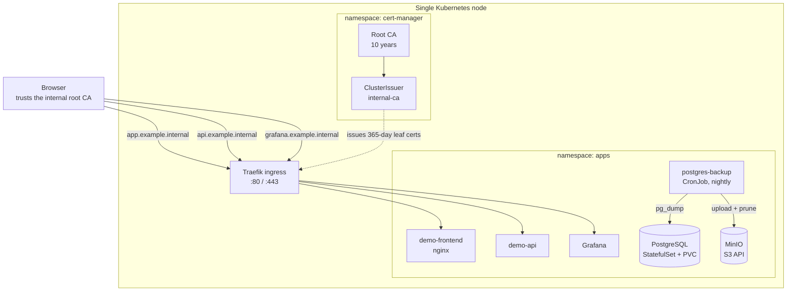

# Architecture

## Components

## Decisions

### One node, and where that hurts

A single node means node loss is downtime. That is acceptable for an internal system with
tens of users, where an hour of downtime is an inconvenience rather than lost revenue — and
it is not acceptable for anything customer-facing.

What single-node genuinely costs:

- **No rolling node upgrades.** Kernel or kubelet upgrades are a maintenance window.
- **`Recreate` deployment strategy for anything with a volume.** A ReadWriteOnce volume
  cannot be attached to an old and a new pod at once, so those workloads have a brief gap
  on every deploy. This is why MinIO declares it explicitly rather than inheriting
  `RollingUpdate` and failing confusingly.
- **Storage is the node.** Local-path volumes do not survive the node. Backups are
  therefore not a nice-to-have; they are the only durability the design has.

What it buys: one machine to patch, one place to look, and an architecture a single
administrator can hold in their head. At this scale that is usually the right trade.

### Certificates live for a year, not a decade

A private CA invites long-lived certificates — nobody is charging per issuance, so why not
ten years? Because Apple's TLS stack rejects any server certificate valid beyond 398 days,
and the resulting failure looks like a trust problem rather than a policy one. Chrome and
Firefox exempt locally-installed roots, so the breakage appears only on Macs and iPhones,
which makes it easy to misdiagnose for hours.

Leaves are issued for 365 days with renewal 60 days out. The root keeps its ten years,
because the limit does not apply to CAs and because rotating a root means touching every
client.

Ninety days would follow the Let's Encrypt convention and is the better default when
certificate expiry is monitored. A year is chosen here for the opposite reason: if
cert-manager silently stops working, a year is enough time to notice, while ninety days
takes the estate down within a quarter. Pick based on whether you have alerting, not on
which number sounds more secure.

Full write-up: [apple-tls-398](https://github.com/Walaskien/apple-tls-398).

### Two hostnames for one application

The demo serves its UI and its API from different hostnames because that is what real
deployments do, and because the failure mode is instructive: a user clicks through a
certificate warning on the UI host and assumes TLS is dealt with. The API host never
prompts — browsers fail `fetch()` silently on an untrusted certificate — so the
application appears to log in successfully on the server while the browser discards the
response.

Keeping that shape in the lab means CORS and per-host trust are exercised rather than
accidentally avoided.

### Platform and applications are separate directories

`platform/` is installed once and upgraded rarely. `apps/` changes constantly. Mixing them
produces clusters nobody dares rebuild, because no one can tell which manifest is load-
bearing infrastructure and which is one team's experiment.

The split also makes the teardown test meaningful: if `make down && make up` reproduces the
platform exactly, the cluster is genuinely disposable.

### Secrets are committed here, and would not be in production

The Secret manifests contain literal passwords. That is defensible only because this
cluster is disposable, listens on localhost, and holds nothing.

For real use the same manifests would take values from an external secret store — Sealed
Secrets or External Secrets Operator — so the repository holds references rather than
credentials. Committing this decision explicitly is preferable to leaving a reader
wondering whether the author knows the difference.

## When this outgrows one node

In roughly the order the pain arrives:

1. **Move the database off the cluster** — managed PostgreSQL, or a dedicated host with
   streaming replication. It is the component whose loss cannot be undone, and the first
   thing worth taking out of a single-node blast radius.
2. **Add nodes for the stateless tier**, so ingress and application pods survive a node
   failure and can be drained for maintenance.
3. **Replace local-path storage** with something network-attached, at which point
   ReadWriteOnce stops meaning "pinned to this machine".
4. **Only then, HA control plane.** Three masters protect the API server, which on a small
   deployment is rarely the thing that breaks first.
